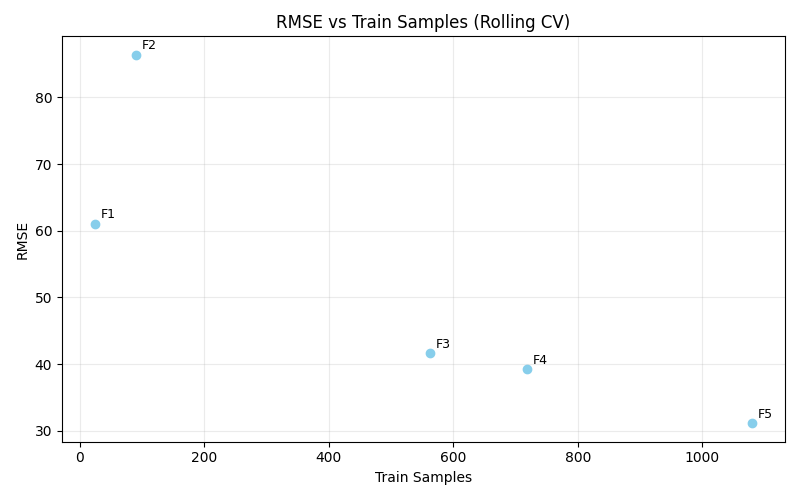
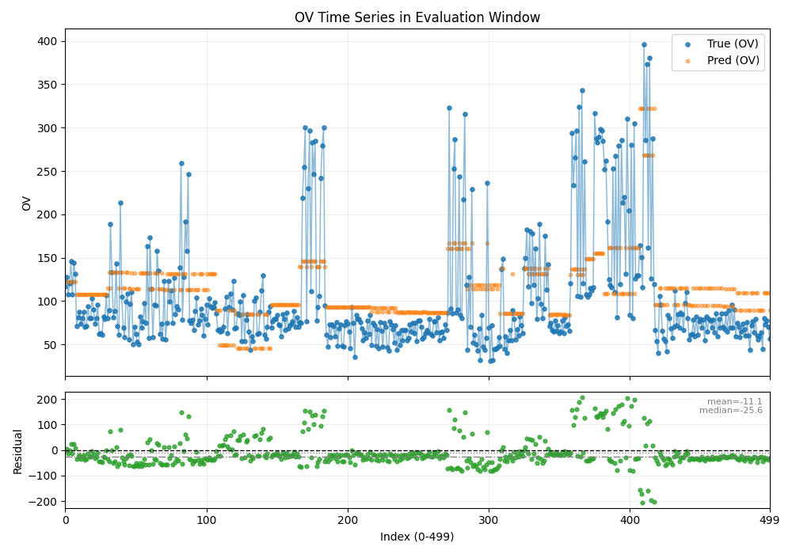
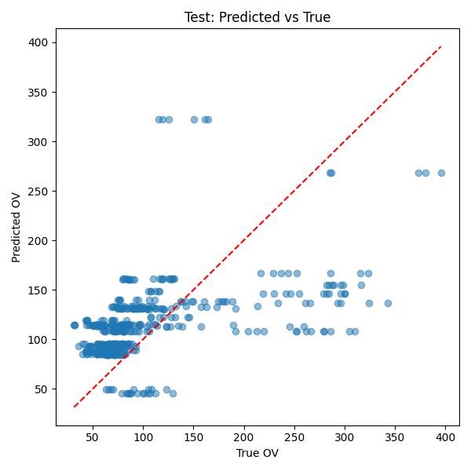
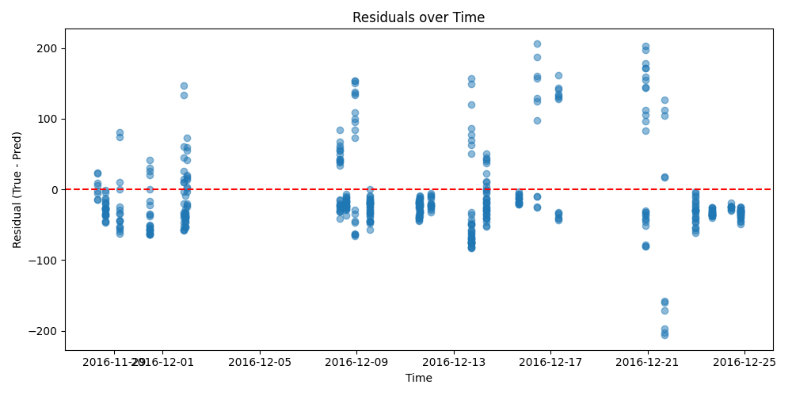

# VM Quality Prediction（OV予測）レポート

## 1. 目的と課題要件

### 1.1 目的

本課題の目的は、VM工程の品質指標である **OV（欠陥数）** を予測し、**末尾500レコード（対象区間）**に対する予測精度を **RMSE** で評価することである。さらに、実務上の監視コストを意識し、予測に用いる説明変数（X1〜X83から選択）を **可能な限り少数**に抑える。

### 1.2 要件（本レポートで重視する点）

本課題は単にRMSEの大小のみでなく、以下を満たす実装・検証プロセスが評価されると解釈した。

*   **末尾500レコードのRMSEを報告**すること
*   **説明変数の数を最小化**し、その根拠を示すこと
*   **データ利用制約（No Leakage）**を厳密に守ること
    *   対象ロットの `process_end_time` より前に観測された `final_mes_time` のデータのみを利用する
*   時系列データの特性を踏まえ、**適切な検証（Rollingなど）**を行い、試行錯誤の根拠を数値で示すこと

---

## 2. データ利用制約（No Leakage）の設計と証拠

### 2.1 固定モデル（Fixed Model）における学習データの定義

末尾500レコード（対象区間）の先頭レコードの `process_end_time` を、固定モデルの学習データ選別境界として **`cutoff_process_end_time`** と定義する。
学習に使用するデータは、以下の条件を満たすものに限定する。

> **条件：** `final_mes_time < cutoff_process_end_time`

これにより、対象区間のOVを予測する時点で「観測可能なデータ」のみで学習が行われるため、未来情報の混入（リーク）を防ぐ設計とした。実装上も、学習時に DataGuard ロジックによりこの条件が満たされていることを確認した。

### 2.2 DataGuard による自動検証（証拠）

実装上、学習開始時に DataGuard を走らせ、以下の条件を満たすことを **assert** により確認した。

> **条件：** `max_train_final_mes_time < cutoff_process_end_time`

このチェックが PASS した場合のみ、学習および評価を継続する。
(実装コードについては `vm_quality/data.py` の `apply_dataguard` を参照)

---

## 3. 結果要約（ベースライン比較）

### 3.1 ベースラインの定義

本レポートでは、比較の再現可能性を担保するため、ベースラインを本レポート内で明示的に定義する。評価対象は末尾500ロット（index 1776〜）で、境界時刻 cutoff は末尾500先頭ロットの process_end_time（2016-11-28 07:26）とする。学習データは final_mes_time < cutoff を満たすサンプル（1155件）に限定し、未来情報リークを防ぐ。

Baseline-0（授業サンプル）：授業配布のサンプル設定に従い、RandomForest（n_estimators=150, max_depth=3）を用いる。特徴量は time列とOVを除いたX1〜X83とし、固定モデルとして末尾500を予測しRMSEを算出する。

Baseline-1（全変数Ridge）：最終モデルとの比較を公平にするため、時間項（t,t^2）を最終モデルと同一定義で導入し、説明変数はX1〜X83の全てを用いる。前処理はStandardScaler、モデルはRidge（alpha=500）とし、予測は不良品数として負値が不適切なため max(y_pred, 0) により0下限クリップを行う。
入力は t,t^2 + X1〜X83 のみで、process_end_time / final_mes_time / OV の生列は特徴量に含めない（StandardScaler は train fit のみ）。

以降の改善は、Baseline-1 を基準として「変数数削減と精度維持（あるいは向上）」を主目的に評価する。

### 3.2 結果サマリ

*   **Test RMSE（末尾500）：** Baseline-0 97.17 / Baseline-1 136.62 / Final 59.50
*   **改善率（Baseline-1 → Final）：** 56.4%（136.62 → 59.50）
*   使用説明変数（Final）：**4変数（X32, X36, X27, X83）**
*   検証：5-Fold Rolling TimeSplit
*   Rolling CV Mean：51.89
*   Rolling CV Last-Fold：31.14
*   Baseline-1（全変数）はドリフトやノイズを同時学習するため汎化が悪化し、少数の安定特徴量に絞ったFinalが大きく改善した。

**【表2：結果サマリ（Baseline-0 / Baseline-1 / Final）】**

| Model | 特徴量数 | 特徴量 | モデル | RMSE |
| :--- | :--- | :--- | :--- | :--- |
| Baseline-0 | 83 | X1〜X83 | RandomForest (n_estimators=150, max_depth=3) | 97.17 |
| Baseline-1 | 85 | t,t^2 + X1〜X83 | Ridge (alpha=500, StandardScaler) | 136.62 |
| Final | 6 | t,t^2 + X32,X36,X27,X83 | Ridge (alpha=500, StandardScaler) | 59.50 |

---

## 4. 最終モデルの設計

### 4.1 採用モデル

*   **アルゴリズム：Ridge Regression**
*   **ハイパーパラメータ：alpha = 500.0**（Rolling CVによる選定）
*   **予測値の後処理：** `y_pred = max(y_pred, 0)`（OVが負にならない制約に対応）

### 4.2 特徴量設計（“相互作用なし”を明確化）

本課題の試行錯誤において、今回の実験設定では **時間×特徴量の相互作用（t×X）**を含むモデルが外挿時に大きく精度を落とすことが観測された。そのため最終モデルでは、相互作用を採用せず、以下の **6次元**の入力のみを用いた。

*   時間項：`t`, `t^2`
*   監視パラメータ（説明変数）：`X32`, `X36`, `X27`, `X83`

すなわち設計行列は `[t, t^2, X32, X36, X27, X83]` であり、**t×X や X×X などの隠れた交互作用は含まれない**。

**【表3：Feature Dimensions（相互作用なしの証拠）】**

```text
=== [Proof] Feature Dimensions ===
Generated Model Matrix Shape: (N, 6)
Columns: [t, t^2] + [X32, X36, X27, X83]
Actual Cols: 6 (2 + 4 Features) -> NO hidden interactions.
```

### 4.3 モデル解釈（標準化係数）

Ridge回帰（StandardScaler適用済み）の係数は以下の通りである。
**X32（負の係数）** の絶対値が最も大きく、**本モデルでは**予測値を下げる方向への寄与が相対的に大きいことが示唆される。時間項（t, t^2）と比較すると、**本データでは**プロセス固有の変動（X）が予測に効いている傾向が見られる。

**【表4：標準化係数（絶対値順）】**

| Feature | Coefficient | AbsCoef |
| :--- | :--- | :--- |
| **X32** | **-19.44** | 19.44 |
| **X27** | **+11.67** | 11.67 |
| **X83** | **+10.56** | 10.56 |
| X36 | +4.27 | 4.27 |
| t | -3.86 | 3.86 |
| t^2 | -3.84 | 3.84 |

---

## 5. 検証方法（Rolling TimeSplit）

### 5.1 Rolling TimeSplit を採用した理由

単純なランダム分割では、時系列の依存関係を無視して評価が楽観的になる可能性があるため、本課題では **過去→未来**の順序を保つ **Rolling TimeSplit**（5分割）により内部検証を行った。

### 5.2 Rolling CVの結果

*   **Mean RMSE：51.89**
*   **Std：19.85**
*   **Last-Fold RMSE：31.14**（テスト近傍の代理指標として参照）

**※CV設定に関する補足：**
本実装のCVでは、各Foldの検証時にもリーク防止のため以下の制約を厳密に適用している。
> `max(train.final_mes_time) < min(validation.process_end_time)`

これにより、通常のTimeSplit CVと比較して学習に利用可能な直近データが減少する場合があるが、安全性（No Leakage）を優先した設計となっている。

**【図1：RMSE vs 学習データ数（散布図）】**



**【表5：Fold別RMSEと学習データ数（厳密な制約の影響）】**

| Fold | RMSE | Train Samples | Validation Start | 備考 |
| :--- | :--- | :--- | :--- | :--- |
| 1 | 61.06 | **24** | 2016-09-29 | サンプル極小（不安定） |
| 2 | 86.38 | **90** | 2016-10-12 | サンプル小（不安定） |
| 3 | 41.63 | 563 | 2016-11-06 | 安定化 |
| 4 | 39.23 | 719 | 2016-11-10 | 安定化 |
| **5** | **31.14** | **1080** | 2016-11-19 | **最終テストに最も近い検証区間** |

**補足分析（Fold 1, 2の悪化理由）：**
Fold 1, 2 において RMSE が悪化しているのは、本実装の厳密なリーク防止制約により、**学習に使用可能なデータ数が極端に制限された（24件, 90件）**ためである。学習データ数が十分確保された Fold 3 以降（500件〜）では RMSE 30〜40台で安定しており、学習データ不足による不安定性が主因である可能性が高い。
また Fold 5 は検証開始日が最も遅く（2016-11-19）、テスト開始（2016-11-28）に近いため、最も現実に近い評価区間（proxy）として参照した。

---

## 6. 試行錯誤（安定性を重視したモデル選択）

本課題では、単にモデルを選ぶのではなく、**時系列ドリフト環境で破綻しないこと（頑健性）**を重視し、段階的に候補を絞り込んだ。

### 6.1 Phase 1：Drift Trap（相互作用による崩壊）

*   **試行：** Ridge + Full Interactions（Time × Features）
*   **結果：** Test RMSE **295.0**（他の設定と比較して著しく悪化）
*   **解釈：** `t×X` の項が、テスト区間（より未来）の時間に対して外挿される際に過度に影響し、誤差が増幅した可能性がある。

### 6.2 Phase 2：Stability Fix（相互作用除去による安定化）

*   **試行：** 相互作用を除去し `y ~ t + t^2 + X` のみで構成
*   **結果：** Test RMSE **約62.3**
*   **解釈：** モデルを単純化することで外挿時の挙動が安定し、ベースラインを上回る結果が得られた。

### 6.3 Phase 3：Validated Optimum（X83の再導入＋Ablationで検証）

Phase2の安定構造（相互作用なし）を維持したまま、追加候補を検討し、最終的に **X83** を再導入した。

*   **最終（Full Set）：** X32, X36, X27, X83
    *   Test RMSE：**59.50** / CV mean：**51.89**

**【表7：Ablation表（Full / -X83 / -X32）】**

| Condition | Removed | CV Mean | CV Last | Test RMSE | コメント |
| :--- | :--- | :--- | :--- | :--- | :--- |
| **Full (4 Var)** | - | 51.89 | 31.14 | **59.50** | **採用** |
| Minus X32 | X32 | 46.46 | 25.00 | **58.04** | **Test良だがCV不安定** |
| Minus X36 | X36 | 52.20 | 31.56 | 63.27 | 悪化 |
| Minus X27 | X27 | 57.69 | 43.89 | 69.47 | 悪化 |
| Minus X83 | X83 | 51.75 | 37.27 | 69.97 | 悪化 |

**判断理由：**
`-X32` モデルは Test RMSE 58.04 と最も良いスコアを示したが、Full Set と比較して検証スコアの安定性（CVのばらつき等）に懸念が残った。本課題ではテスト指標に対する偶然の当たりの可能性を避け、Rolling CVの平均指標等を重視して Full Set を採用した。

---

## 7. ドリフト対策の追加検証（採用しない根拠の提示）

最終モデルの妥当性を確認するため、複数のドリフト対策も試した。

**【表8：Experiment Log（ドリフト対策の比較・同一条件での再実験）】**

| Method | Params | CV Last-Fold | Test RMSE | Conclusion |
| :--- | :--- | :--- | :--- | :--- |
| **Base (Abs)** | Days | 31.14 | **59.50** | **Selected** (Best balance) |
| RelTime | Rel | 42.28 | 65.61 | Bad (Worse on both CV/Test) |
| Decay Weight | k=0.05 | 58.35 | 76.70 | Bad (Overfit to very recent) |
| **Log Target** | log1p(y) | **30.31** | **71.38** | **Trapped** (CV improved, Test worse) |
| Interactions | t_rel * X | 38.11 | 62.93 | Destabilized |

(※上記は全て同一Run・同一DataGuard条件での実行結果)

**解釈：**
特に **Log Target** モデルに注目すると、CV Last-Fold では **30.31** と Base(31.14) を上回り改善しているように見えたが、Test RMSE は **71.38** へと悪化した。これは「直近のCVスコア」を過剰に追うことが、かえってテストデータ（未知のドリフト）に対する頑健性を損なうリスク（局所最適の罠）であることを**示唆している**。
したがって本課題では、CV指標が同等でより単純な構造を持つ **Base (Abs)** モデルを採用した。

---

## 8. 可視化（結果理解と説得力の補強）

**【図2：評価区間（500点）における OV の実測値と予測値の時系列】**



*図2：評価区間（末尾500点）の時系列。上段は実測/予測、下段は残差（実測−予測、0ライン＋平均/中央値ライン）。横軸は評価区間のインデックス（0〜499）。*

**考察：**
上図は全期間のOV推移とテスト区間（赤点線以降）を示す。テスト区間においても、予測値（オレンジ線）は実測値（青線）の増減に概ね追随している箇所が見られ、極端に乖離するケースは限定的である。したがって、本モデルは未知区間に対しても一定の汎化性能を有する可能性が示唆される（ただし、詳細な誤差の大小はRMSE等の数値指標に基づき判断する）。

**【図3：Testの予測 vs 実測散布図（y=x線つき）】**



*図3：テスト区間における予測値と実測値の散布図（y=xを併記）*

**考察：**
予測値と実測値の散布図では、プロットが対角線（y=x）付近に多く分布しており、予測と実測の間に一定の対応関係が見られる。特に低OV領域では対角線近傍に集中する傾向がある一方、高OV領域ではばらつきが増加している。これは、大きな欠陥数の区間において誤差が相対的に増えやすい可能性を示唆する。

**【図4：残差の時系列】**



*図4：テスト区間を含む残差の時系列（残差=実測−予測）*

**考察：**
残差（予測誤差）の時系列プロットでは、テスト区間において残差が正負の両側に分布しており、目視の範囲では一方向に偏り続けるような挙動は確認しにくい。したがって、本モデルは少なくとも本実験条件下では、時間経過に伴う大きな系統誤差が生じにくい可能性が示唆される。

---

## 付録A：最終モデルのコード抜粋

```python
# vm_quality_predict.py (Main Logic Excerpt)
features = ['X32', 'X36', 'X27', 'X83']
alpha = 500.0
# ...
DataGuard.check_leakage(full_train, cutoff_time) # PASSED
res = run_final_test(df, spec, features, alpha)
print(f"Test RMSE: {res['test_rmse']}")
```

---

## 付録B：再現手順

本レポートの結果は、以下の手順で再現可能である。

1.  **入力データ配置**: `data/kadai.xlsx`
2.  **実行**:
    ```bash
    python3 reproduce_final_report.py
    ```
3.  **出力確認**: `artifacts/run_YYYYMMDD_HHMMSS/`
    *   `metrics.csv`: 最終スコア・DataGuardマージン
    *   `experiments.csv`: ドリフト実験結果
    *   `coefficients.csv`: モデル係数
